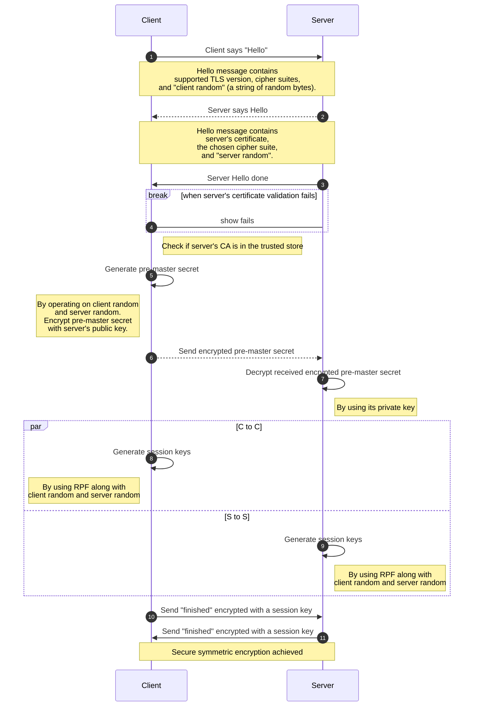

# Self-Signed Certificate {DRAFT}
## Overview
In today's internet communication, ensuring security is of paramount importance, and HTTPS (Hypertext Transfer Protocol Secure) is the standard technique used to achieve this. Public Key Infrastructure (PKI) plays a critical role in this process by issuing certificates that can be trusted by web browsers. However, during development, self-signed certificates can serve as temporary alternatives to PKI-issued certificates, expediting the service development process by avoiding the lengthy certificate issuance process.

This README section provides an overview of basic concepts related to encryption, communication handshaking, the generation of self-signed certificates, and offers a practical demonstration of a simple Flask web application using HTTPS. 

*For those already familiar with encryption and handshaking concepts and who wish to proceed directly to certificate generation and HTTPS usage, you can go to [Self-signed Certificate Generation](#self-signed-certificate-generation).*

## Basic Concepts of Encryption
Encryption is a process that involves converting plaintext into ciphertext by applying a key, which can be a combination of various factors or algorithms. In this context, we introduce two fundamental concepts of encryption: symmetric and asymmetric encryption.

Symmetric encryption is a method in which the same key is used for both encryption and decryption of the original text. In contrast, asymmetric encryption relies on a pair of keys: a public key for encryption and a private key for decryption. This approach enhances security by allowing the encryption to be achieved using the public key, while only the private key can decrypt the ciphertext.

## Handshaking
Handshaking is a process for establishing a secure communication channel between the client (web browser) and the server. During this process, the two parties exchange identification information and keys necessary for data encryption. Communication handshaking encompasses both asymmetric and symmetric encryption techniques.



At this stage, the client and server can exchange encrypted messages using the session key, which remains in use for both encryption and decryption until the session concludes.

## Self-signed Certificate Generation
In this section, we will generate a chain of three certificates: a Root CA, an intermediate CA and a server certificate, to simulate the real-world scenarios.

### Steps
1. Clone the project and change directory to the project
   ```bash
   git clone https://github.com/adelinewei/self-signed-certificate.git
   cd self-signed-certificate
   ```
2. Prepare directories and the database
    ```bash
    make prepare
    ```
3. Create Root CA certificate
   ```bash
   make root
   ```
4. Create intermediate CA certificate
   ```bash
   make ca
   ```
5. Create server certificate
   ```bash
   make server
   ```

At this stage, a complete chain of certificates has been created and is now ready for use in HTTPS configurations. Let's proceed to the demonstration of setting up a Flask web application with HTTPS.

## Flask Web Application using HTTPS Configuration
### Installation
1. Clone the project and change directory to the project (skip if it is done before)
   ```bash
   git clone https://github.com/adelinewei/self-signed-certificate.git
   cd self-signed-certificate
   ```
2. Create a Python virtual enviornment
   ```bash
   python3 -m venv .venv
   ```
3. Activate created Python virtual environment
   ```bash
   source .venv/bin/activate
   ```
4. Install dependencies
   ```bash
   make install
   ```
### Usage
Run the Flask web application
```bash
make start
```
The Flask web application is currently running and serving the `Hello World!` message on IP address `127.0.0.1`, using port `5000`.


When navigating to the URL https://127.0.0.1:5000 in your web browser, you may encounter a security warning. This warning is normal because the self-signed certificate used is not trusted by your browser. To proceed, click the "Advanced" button and select "Proceed to 127.0.0.1 (unsafe)", and you will be able to view the "Hello World!" message.


To make your browser trust the certificate, such as on macOS, open the "Keychain Access" application. In the left sidebar, select "login", then click on "Certificates". Finally, drag the "server.crt" file that was generated previously into the Keychain Access window.


To establish trust for the certificate, double-click on the added certificate. Then, expand the "Trust" section and select "Always Trust" for the "When using this certificate" option. During this process, you may be asked to enter a password.


Following the previous steps, the warning displayed in the search bar should no longer appear when you refresh the page. Furthermore, you will notice a lock icon, indicating that the website you are browsing is now trusted and secure.


## Project Status
In progress